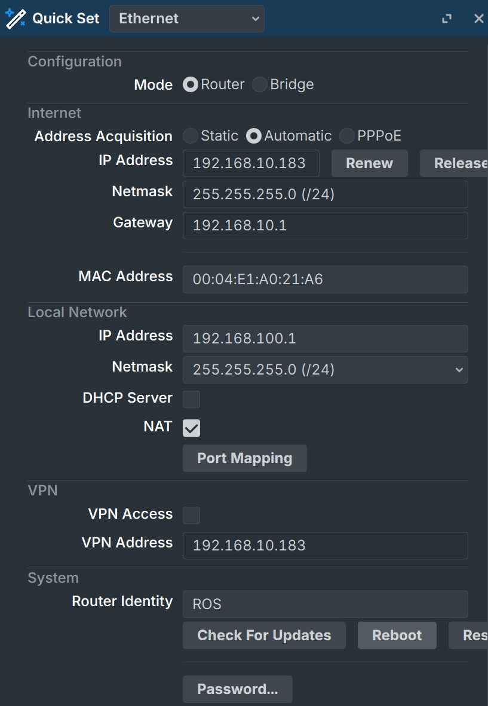
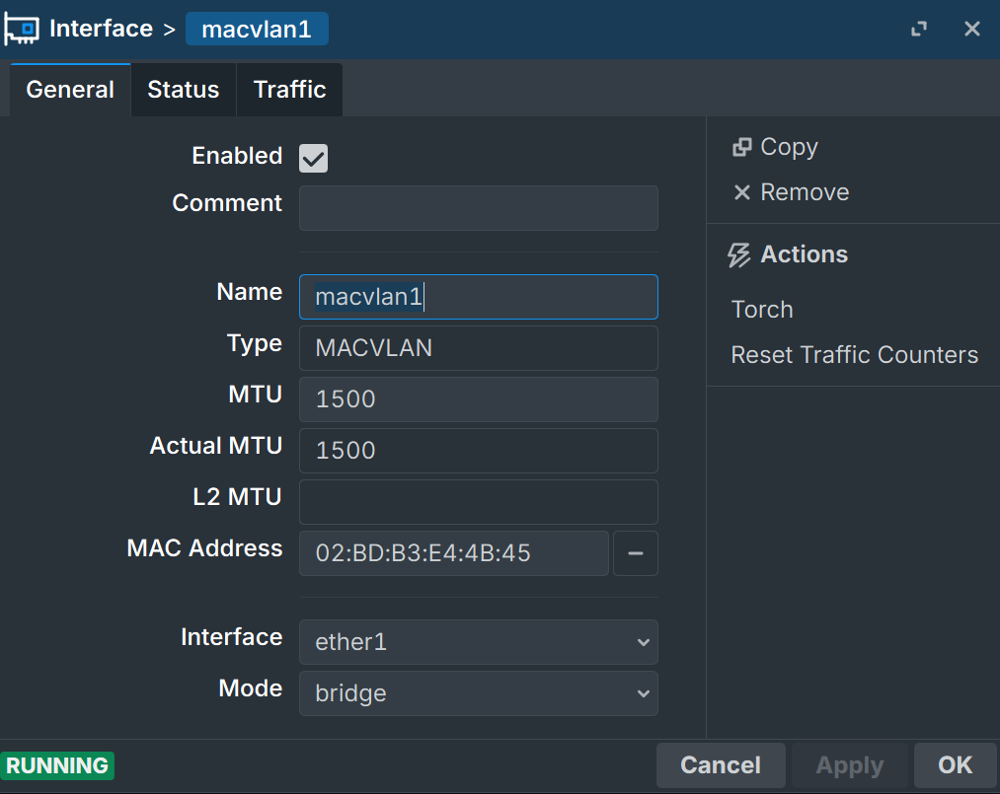
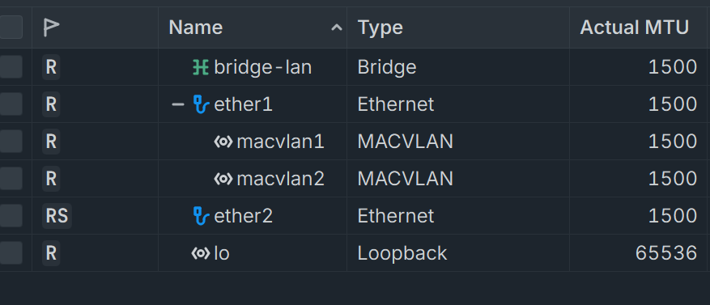

# 前言
由于Openwrt在24.10换用ntftables之后mwan3奇怪的兼容性问题导致其多线叠加失效，自上学期以来一直缠绕于心的多拨叠加计划就自此搁置了，在这学期配置完PVE后，在PVE中的RouterOS上希望能重启计划以解决带宽紧张的问题
:::warning
根据学校限速策略的不同，可能需要多个人的校园网账号
:::
# 一，跟随Quick Set配置成功联网
为了后续网络的连通性，在Quickset中正确配置联网，只用使其成为上游路由器的另一个路由即可

:::note
这个配置未开启DHCP，建议自行修正
:::
# 二，新建Macvlan并配置DHCP Client

由于ROS本身并不区分Wan口和Lan口，给予了极高的自由度，我们仅需在Interfaces界面选择New新建两个Macvlan口指向我们指定成为DHCP Server（一般为Ether1）即可

配置好的结果如图
此时由于NAT规则未覆盖，我们会发现上游路由器的管理地址无法连接
需要在interfaces->interfaces list中将macvlan加入Wan中，之后在IP->Firewall->NAT中确保NAT规则中WAN经过masquerade伪装
# 三，配置防火墙规则和PCC叠加
```
/ip firewall mangle
# 动作一：排除内网
add action=accept chain=prerouting dst-address-type=local in-interface=bridge

# 动作二：保证原路返回
add action=mark-connection chain=prerouting connection-mark=no-mark in-interface=pppoe-out1 new-connection-mark=conn_wan1 passthrough=yes
add action=mark-connection chain=prerouting connection-mark=no-mark in-interface=pppoe-out2 new-connection-mark=conn_wan2 passthrough=yes
add action=mark-routing chain=output connection-mark=conn_wan1 new-routing-mark=route_wan1 passthrough=no
add action=mark-routing chain=output connection-mark=conn_wan2 new-routing-mark=route_wan2 passthrough=no

# 动作三：核心 PCC 切割新连接
add action=mark-connection chain=prerouting connection-mark=no-mark connection-state=new dst-address-type=!local in-interface=bridge new-connection-mark=conn_wan1 passthrough=yes per-connection-classifier=both-addresses-and-ports:2/0
add action=mark-connection chain=prerouting connection-mark=no-mark connection-state=new dst-address-type=!local in-interface=bridge new-connection-mark=conn_wan2 passthrough=yes per-connection-classifier=both-addresses-and-ports:2/1

# 动作四：赋予路由标记
add action=mark-routing chain=prerouting connection-mark=conn_wan1 in-interface=bridge new-routing-mark=route_wan1 passthrough=yes
add action=mark-routing chain=prerouting connection-mark=conn_wan2 in-interface=bridge new-routing-mark=route_wan2 passthrough=yes
```
以上为可执行代码，可依据需要进行修改或添加
在完成并测试后，即可享受多线程下下载/上传翻倍的快乐